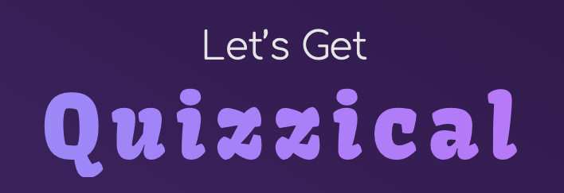

Quizzical is a fun and interactive web application that offers various quiz and game modes to engage users. The application is built with HTML, CSS, and JavaScript, providing a smooth and responsive user experience.

## Table of Contents 📚

1. [Project Overview](#project-overview-)
2. [Demo](#demo-)
3. [Features](#features-)
4. [Installation](#installation-)
5. [Usage](#usage-)
6. [Built With](#built-with-)
7. [Contributing](#contributing-)
8. [Contact](#contact-)
9. [License](#license-)
10. [Acknowledgments](#acknowledgments-)

## Project Overview 📝

Quizzical is a responsive web application designed to provide users with various quiz categories and game modes. It allows users to explore quizzes, test their knowledge, and have fun with friends through interactive games. The application features a sleek design and intuitive navigation to ensure a seamless user experience.

## Demo 💡

Demo of quiz with multiple choice<br>
 <br> <br>
Demo of Never Have I Ever<br>
<br>

## Features ✨

- Quiz Categories: Explore various categories such as history, music, science, movies, and more.
- Game Modes: Participate in interactive games like "Never Have I Ever" and "Why Me?".
- Score Tracking: Track your scores and view final results.

## Installation 📦

### Live

To launch this project, click the link below:

[Quizzical](https://quizaholics.netlify.app/)

### Installing

1. Clone the repo:

    ```bash
    git clone https://github.com/julieoyen/quizaholics
    ```

2. Navigate to the project directory:

    ```bash
    cd quizzical
    ```

3. Open `index.html` in your preferred web browser.

## Usage 🔧

### Playing Quizzes and Games 🎮

1. Navigate to the home page and select either "Quiz" or "Games".
2. Choose a quiz category or game mode to start playing.
3. Follow the prompts to answer questions and track your score.

## Built With 🛠️

- HTML
- CSS
- JavaScript

## Contributing 🤝

1. Fork the Project
2. Create your Feature Branch (`git checkout -b feature/AmazingFeature`)
3. Commit your Changes (`git commit -m 'Add some AmazingFeature'`)
4. Push to the Branch (`git push origin feature/AmazingFeature`)
5. Open a Pull Request

## Contact 📞

Feel free to reach out to me for any inquiries or contributions.

- [LinkedIn](https://www.linkedin.com/in/julie-bertine-%C3%B8yen-872b0a233/)

## License 📜

This project is licensed under the MIT License. See the [LICENSE](LICENSE) file for more details.

## Acknowledgments 🙏

A big thank you to Anniken, Ingrid, Erica, and Fillip, who also contributed to this project!
